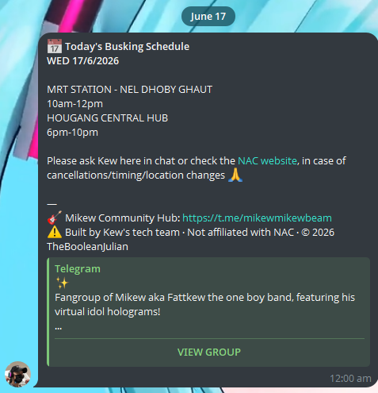

<div align="center">

# MikewNACBot

**Telegram bot that scrapes FattKew / OneBoyBand's NAC busking schedule and posts it to a group chat — automatically or on demand.**




</div>

---

> **Disclaimer:** This bot is built and maintained by TheBooleanJulian. It is not affiliated with, endorsed by, or associated with the National Arts Council (NAC) or any related government entities. Schedule data is sourced publicly from the NAC eServices website and may not always be accurate or up to date. Always verify directly with Kew or the [NAC website](https://eservices.nac.gov.sg/Busking/busker/profile/dbc5b6bc-e22a-4e60-9fe4-f4d6a1aa17a4).

> **Copyright © 2026 TheBooleanJulian.** All rights reserved. Unauthorised redistribution or commercial use of this code is prohibited.

---

## What it does

MikewNACBot scrapes FattKew / OneBoyBand's upcoming busking schedule from the NAC eServices website and formats it into clean Telegram messages. It auto-posts next week's full schedule every Friday at 8 PM SGT, and today's schedule every day at midnight SGT — so the group chat stays up to date without anyone having to lift a finger. Manual commands let anyone pull the current or next week's schedule on demand, and admins can add, remove, or modify show entries that aren't listed on NAC.

## Features

- Auto-posts next week's Mon–Sun schedule every **Friday at 8 PM SGT**
- Auto-posts today's schedule every day at **midnight SGT**
- Manual commands: `/today`, `/thisweek`, `/nextweek`
- Admin-only schedule overrides — add, remove, or modify shows not on NAC
- Overrides are applied automatically to all queries and auto-posts
- Flask health check endpoint (`/healthz`) and branded status page on port 8080
- Containerised via Docker, deployed on Zeabur

## Tech Stack

| Layer | Choice |
|---|---|
| Bot | python-telegram-bot 21.6 (polling) + APScheduler |
| Scraper | requests + BeautifulSoup4 |
| Scheduler | APScheduler 3.10.4 |
| Health check | Flask 3.1 |
| Hosting | Zeabur (Docker, GitHub CI/CD) |

## Commands

| Command | What it does |
|---|---|
| `/thisweek` | Post this week's schedule (Mon–Sun) |
| `/nextweek` | Post next week's schedule |
| `/today` | Post today's schedule |
| `/help` | Show help message |
| `/start` | Same as `/help` |

**Admin-only** (requires `ADMIN_IDS`):

| Command | What it does |
|---|---|
| `/addshow <date> <start> <end> <location...>` | Add a custom show override |
| `/removeshow <date> <location...>` | Remove a show override |
| `/modifyshow <date> <newstart> <newend> <location...>` | Modify an existing show override |
| `/overrides` | List all active overrides |
| `/clearoverride <id>` | Clear a specific override by ID |

## Quick Start

```bash
git clone <repo>
cd mikew-gcal-v3
pip install -r requirements.txt
cp .env.example .env
# Fill in BOT_TOKEN, CHAT_ID, and optionally ADMIN_IDS in .env
python bot.py
```

## Configuration

| Variable | Required | Description |
|---|---|---|
| `BOT_TOKEN` | Yes | Telegram bot token from @BotFather |
| `CHAT_ID` | Yes | Telegram chat/group ID to post schedules to |
| `ADMIN_IDS` | No | Comma-separated Telegram user IDs with access to admin commands |

## Project Structure

```
mikew-gcal-v3/
├── bot.py            Telegram bot + APScheduler (Friday 8 PM + daily midnight cron)
├── scraper.py        HTTP scraper (requests + BeautifulSoup)
├── overrides.py      Schedule override management (add/remove/modify shows)
├── health.py         Flask health check and status page (port 8080)
├── requirements.txt  Python dependencies
├── Dockerfile        Container definition
├── zeabur.json       Zeabur deployment config
└── .env.example      Environment variable template
```

## Deployment

Deployed on Zeabur via Docker. Push to `main` triggers a redeploy. The container exposes port 8080 for the health check endpoint (`/healthz`) and a branded status page (`/`).

## Status / Roadmap

- [x] NAC scraper with pagination
- [x] Friday auto-post (next week's schedule)
- [x] Daily midnight auto-post (today's schedule)
- [x] Admin override commands
- [x] Health check + status page
- [x] Deployed on Zeabur
- [ ] Cancellation detection / change alerts

## Changelog

- **Apr 2026** — Fixed HTML parse mode escaping for angle brackets in admin command examples; fixed missing module import in Docker build
- **Apr 2026** — Added Flask health check server (`/healthz` + `/`) with TheBooleanJulian branded status page; added admin commands (`/addshow`, `/removeshow`, `/modifyshow`, `/overrides`, `/clearoverride`) and schedule overrides system; improved `.env.example` and inline documentation
- **Mar 2026** — Fixed duplicate auto-posts on redeploy using `misfire_grace_time` and `max_instances`; added copyright and disclaimer to all files and bot messages
- **Mar 2026** — Fixed today's date resolving in SGT (was using server local timezone); added signature line to all schedule message outputs
- **Mar 2026** — Added `/today` command and daily midnight auto-post; renamed `/schedule` to `/thisweek`; updated `/start` text
- **Mar 2026** — Initial working bot: `bot.py`, scraper with pagination fix, NAC events endpoint

## License

Copyright © 2026 TheBooleanJulian. All rights reserved. Unauthorised redistribution or commercial use of this code is prohibited.

---

<div align="center">
<sub>Built by <a href="https://github.com/TheBooleanJulian">@TheBooleanJulian</a></sub>
</div>